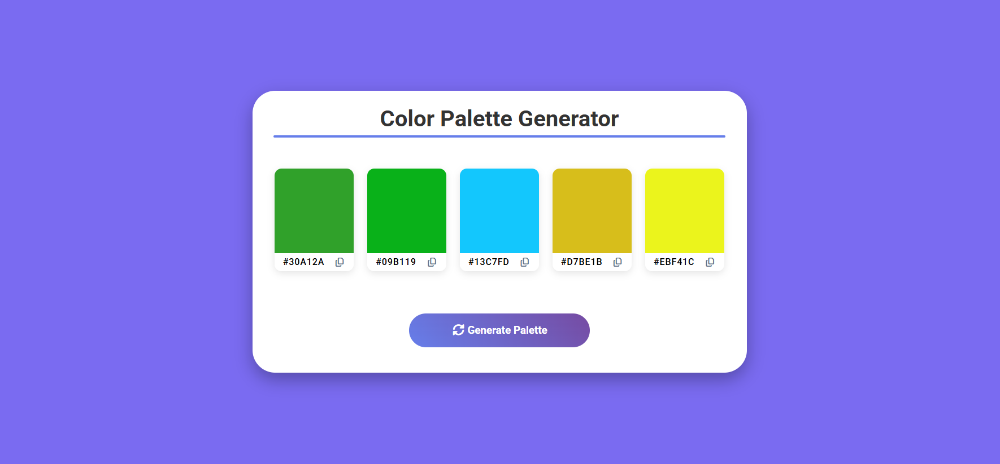
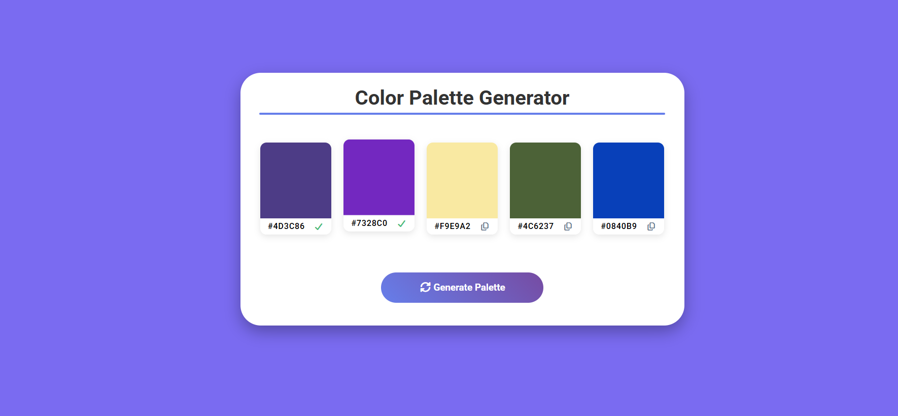

# COLOR PALETTE GENERATOR

A simple web page for generating color palettes. It was built with HTML, CSS, and JavaScript.  

__DISCLAIMER__: This page does not make use of any dedicated color palette generation algorithm. Instead it uses a simple random number generation approach for generating color hex values.

---
  

  

---
MIT LICENSE  

---